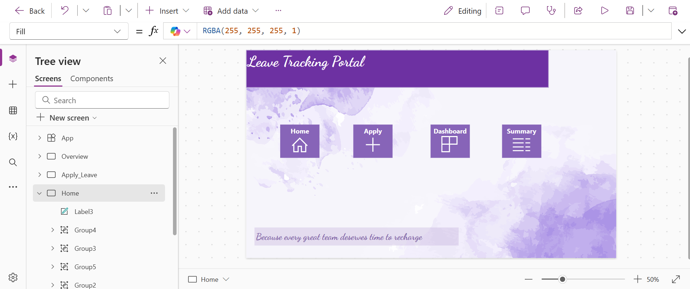
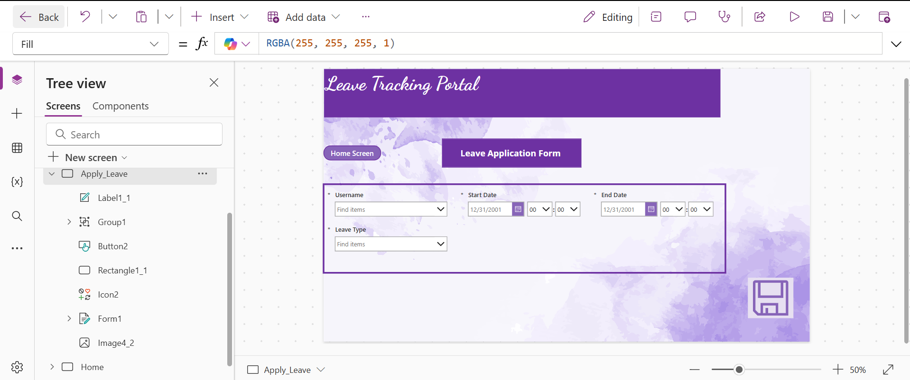
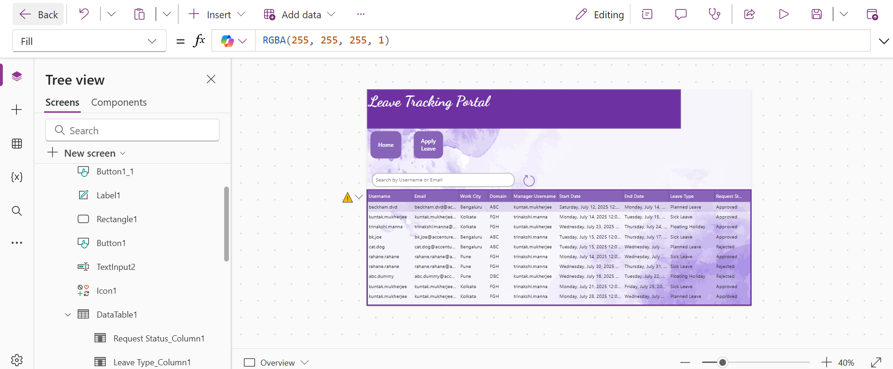
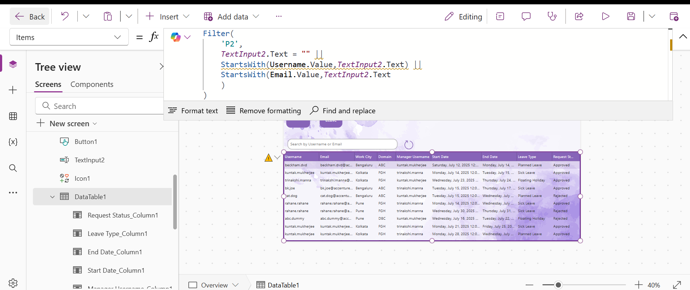
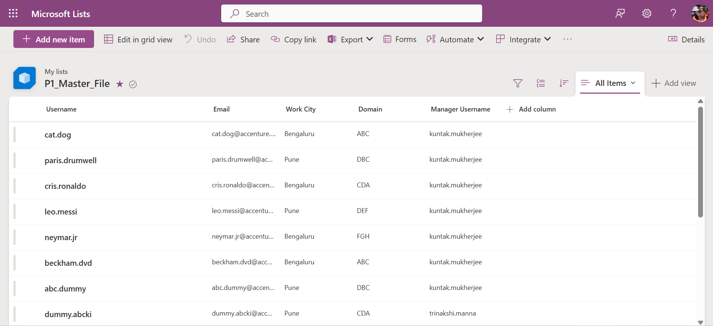
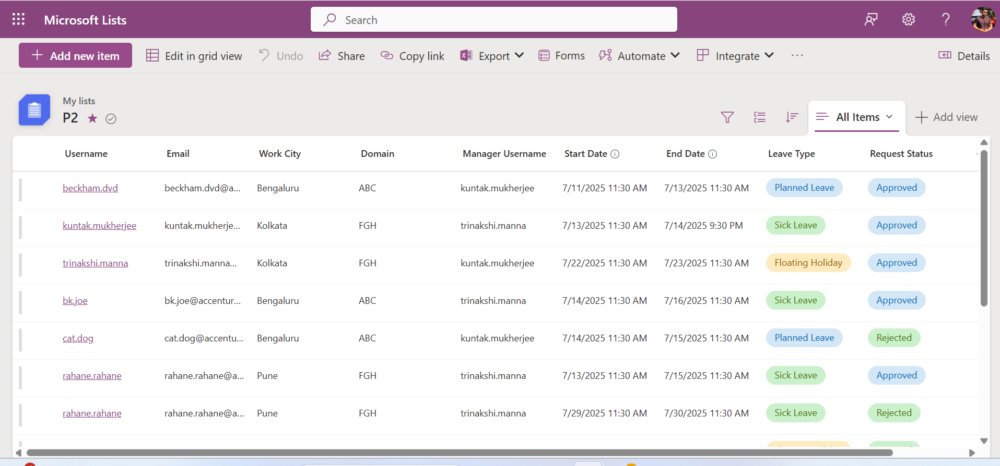
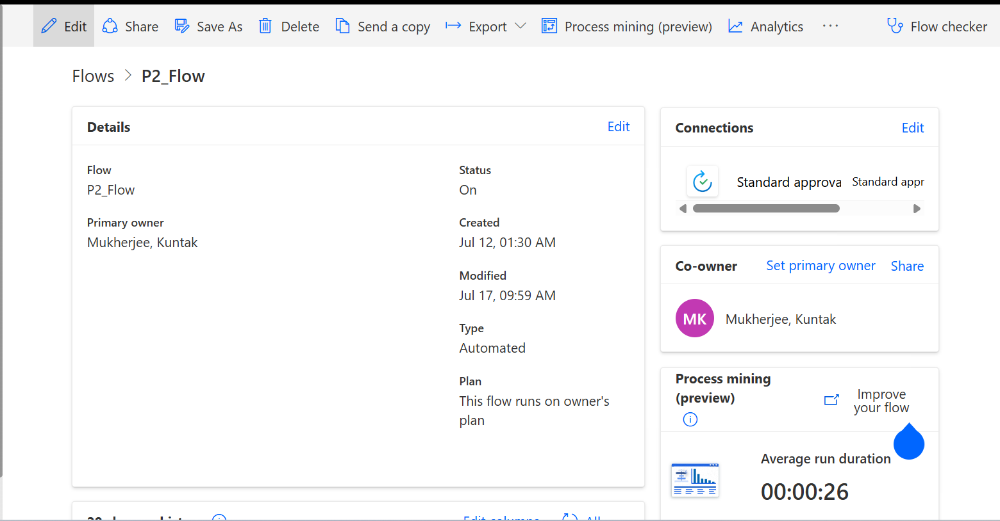
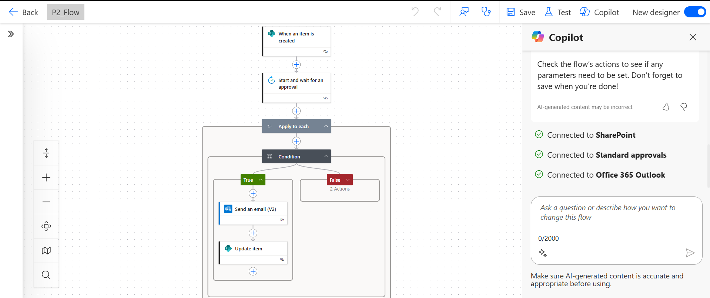

# Leave Tracking Portal (Power Apps + Power Automate + SharePoint)

A business-ready **Leave Tracking Portal** developed using **Microsoft Power Platform**.  
The app enables employees to submit leave requests, managers to approve or reject them via automated workflows, and provides a real-time dashboard to monitor all requests.

---

## 🌟 Features
- **Apply Leave**: Employees submit leave type, start and end dates.  
- **Manager Approvals**: Automated approval requests sent via Power Automate; updates request status in SharePoint.  
- **Real-Time Dashboard**: Managers track requests (Pending, Approved, Rejected) in a live data table.  
- **Search & Filter**: Dashboard includes search by username/email.  
- **Data Integration**: SharePoint Master list for employee metadata + Leave Requests list for tracking.  

---

## 🏗️ Architecture

**Tech Stack**
- **Power Apps (Canvas App)** → Front-end UI (forms, dashboard).  
- **SharePoint Lists** → Data storage:  
  - `P1_Master_File` (Employee metadata)  
  - `P2` (Leave requests)  
- **Power Automate Flow** → Workflow automation: approval, notifications, status updates.  
- **Outlook** → Email notifications for approvals and employee updates.  

---

## 📸 Screenshots & Walkthrough

**Home Screen**  

**Apply Leave (Form submission)**  

**Dashboard (Real-time request tracking)**  

**Data Table Filter Logic**

**Sharepoint Lists**

**Power Automate Flow - Trigger → Approval → Condition → Email + Update Status** 

🚀 How It Works
Employee applies for leave in the Canvas App.

Entry is created in SharePoint list P2 (status = Pending).

Power Automate sends approval email to the manager.

Manager Approves/Rejects:

Approved → Request updated + employee notified.

Rejected → Request updated + employee notified.

Dashboard auto-refreshes with the latest status.

💡 Resume Highlights
Designed and implemented an end-to-end leave tracking solution using Microsoft Power Platform.

Automated approval workflows with Power Automate, reducing manual effort and improving turnaround.

Built a real-time dashboard integrated with SharePoint for easy manager oversight.

Packaged and documented solution in a professional GitHub portfolio project.
